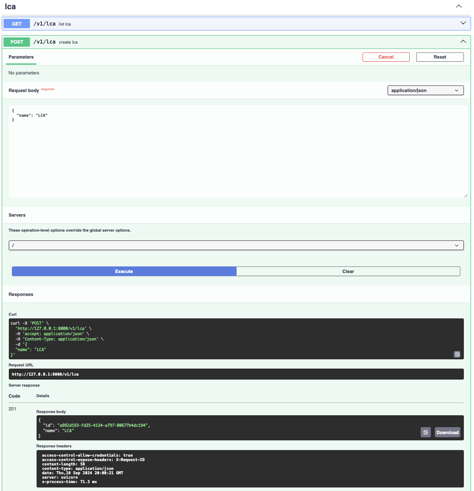
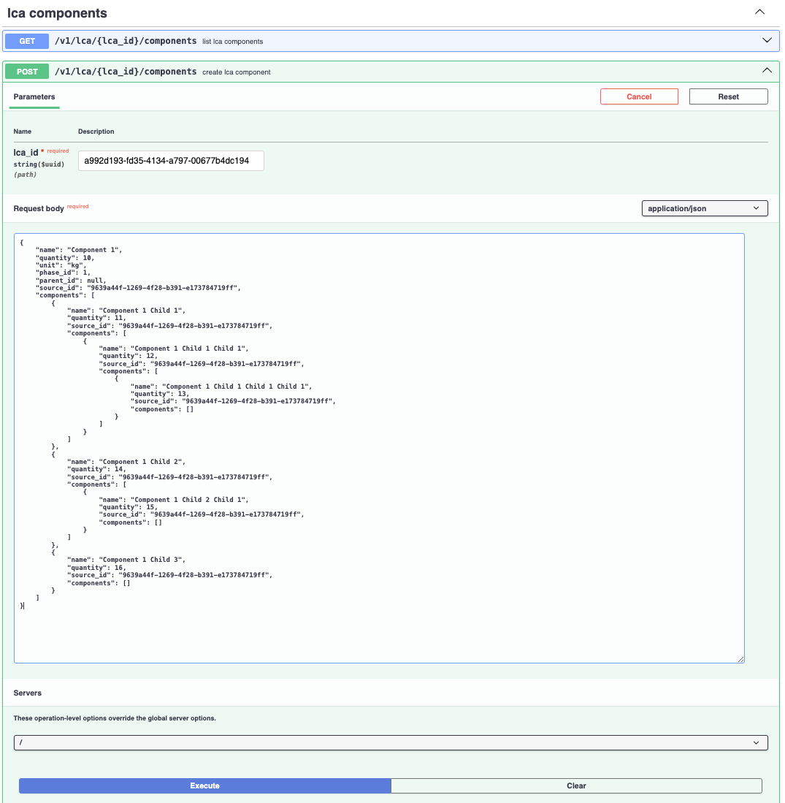
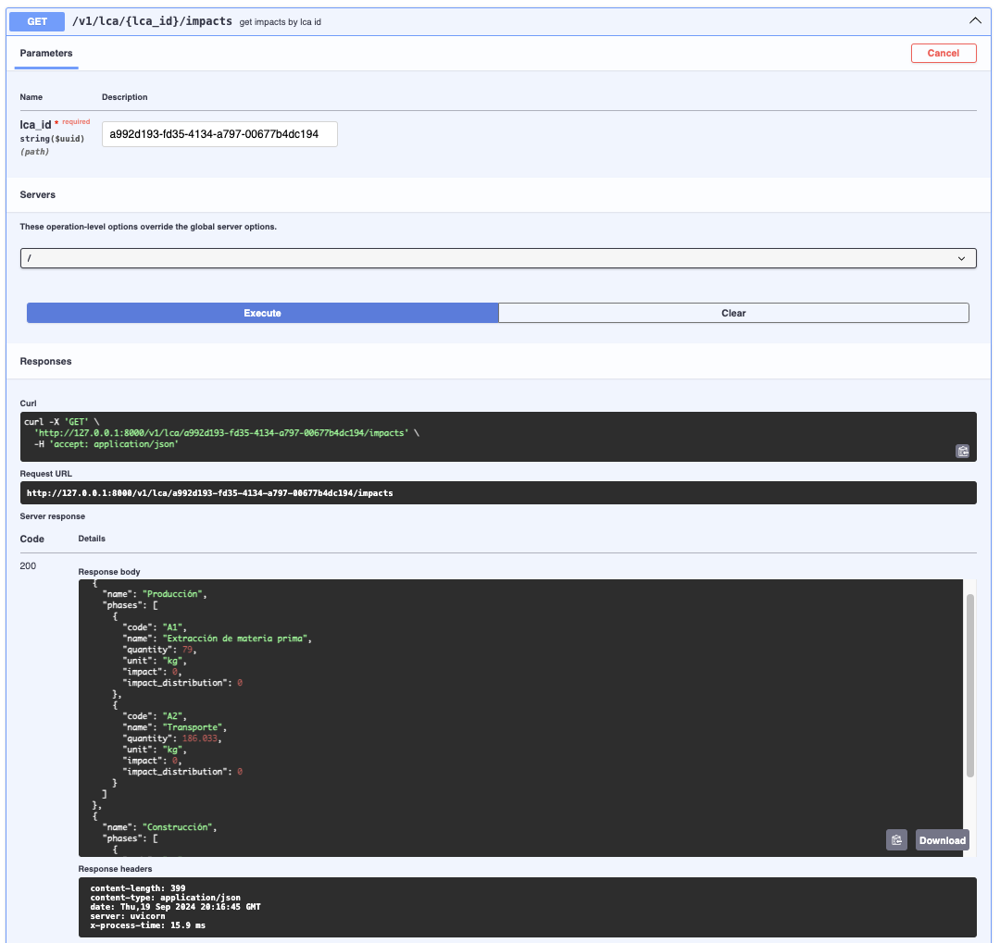

<h1 align=center><strong>Dcycle Backend Application Setup</strong></h1>

This guide will walk you through setting up the backend application.

## Python, PyEnv, & Virtual Environment Setup

1. **Clone the Dcycle Backend repository:**

    ```shell
    git clone git@github.com:pjcopado/dcycle-challenge-01.git
    ```

2. **Configure .env:**

To configure your backend application, create a `.env` file in the root directory of your project. This file will contain all the necessary environment variables required to run the application.

Here is an example of what your `.env` file should include:

```env
ENVIRONMENT=LOCAL

# Settings
PROJECT_NAME=dcycle
SWAGGER_ENABLED=True
DEBUG=True

# DB Settings
POSTGRES_USERNAME=postgres
POSTGRES_PASSWORD=postgres
POSTGRES_HOST=localhost
POSTGRES_PORT=5432
POSTGRES_DB=dcycle
```

----

## Method A: Using Docker

### Step 1: Ensure you have the following installed:

- [Docker](https://docs.docker.com/get-docker/)
- [Docker Compose](https://docs.docker.com/compose/install/)

### Step 2: Build the image:

1. **Build the images:**
    ```shell
    docker compose build
    ```

1. **Start the containers:**
    ```shell
    docker compose up
    ```

## Method B: Running local

### Step 1: Install Python 3.11.4 using PyEnv

**macOS:**

1. **Install Python 3.11.4:**
    ```shell
    pyenv install 3.11.4
    ```

2. **Set Python 3.11.4 as the global version:**
    ```shell
    pyenv global 3.11.4
    ```

**Windows:**

- Download and install Python 3.11.4 from the official [Python website](https://www.python.org/downloads/).
- Ensure Python is added to your system’s PATH during installation.

### Step 2: Install PyEnv-VirtualEnv

**macOS:**

1. **Install pyenv-virtualenv via Homebrew:**
    ```shell
    brew install pyenv-virtualenv
    ```

### Step 3: Create and Activate a Virtual Environment

**macOS:**

1. **Create a virtual environment named `dcycle`:**
    ```shell
    pyenv virtualenv 3.11.4 dcycle
    ```

2. **Set the virtual environment as the local environment:**
    ```shell
    pyenv local dcycle
    ```

**Windows:**

1. **Create a virtual environment:**
    ```shell
    python -m venv dcycle
    ```

2. **Activate the virtual environment:**
    ```shell
    .\dcycle\Scripts\activate
    ```

### Step 4: Install Project Dependencies

1. **Update the `requirements.txt` file:**
    - Ensure that the following line is present in `requirements.txt`:


2. **Install dependencies:**
    ```shell
    pip install -r requirements.txt
    ```

---

## Database Setup

### Step 1: Install and Start PostgreSQL

**macOS:**

1. **Install PostgreSQL 14 via Homebrew:**
    ```shell
    brew install postgresql@14
    ```

2. **Start PostgreSQL:**
    ```shell
    brew services start postgresql@14
    ```

**Windows:**

1. **Download and install PostgreSQL 14** from the official [PostgreSQL website](https://www.postgresql.org/download/).
2. **Start PostgreSQL** using the PostgreSQL service in Windows or this command:

    ```shell
    pg_ctl start
    ```

### Step 2: Create a Database

- Use your preferred database editor (e.g., TablePlus, DBeaver, or pgAdmin) to create a new database for the application.

### Step 3: Configure Database Credentials

1. **Add your database credentials to the `.env` file** in the root directory:
    ```
    POSTGRES_USERNAME=your_username
    POSTGRES_PASSWORD=your_password
    POSTGRES_HOST=127.0.0.1
    POSTGRES_PORT=5432
    POSTGRES_DB=focustudio
    ```

---

## Alembic for Database Migrations

### Step 1: Update Alembic Configuration

1. **Modify the `alembic.ini` file** to set the correct migration script location:
    ```ini
    [alembic]
    # Path to migration scripts
    script_location = src/migrations
    ```

### Step 2: Run Migrations

1. **Generate a new migration script:**
    ```shell
    alembic revision --autogenerate -m "YOUR NOTES ABOUT THE DATABASE MIGRATION HERE"
    ```

2. **Apply the migrations to your database:**
    ```shell
    alembic upgrade head
    ```

---


## Running the FastAPI Backend Server

**macOS & Windows:**

1. **Make sure you are in the `backend/` directory:**

2. **Run the server:**
    ```shell
    uvicorn src.app.main:app --reload
    ```

3. **To stop the server**, press `Ctrl + C`.

---
---

## Application Usage

1. **Create LCA:**



2. **Asociate Components to LCA:**

n-recursive component levels are allowed.
children `unit` and `phase_id` are inherited from parent



```py
{
    "name": "Component 1",
    "quantity": 10,
    "unit": "kg",
    "phase_id": 1,
    "parent_id": null,
    "source_id": "9639a44f-1269-4f28-b391-e173784719ff",
    "components": [
        {
            "name": "Component 1 Child 1",
            "quantity": 11,
            "source_id": "9639a44f-1269-4f28-b391-e173784719ff",
            "components": [
                {
                    "name": "Component 1 Child 1 Child 1",
                    "quantity": 12,
                    "source_id": "9639a44f-1269-4f28-b391-e173784719ff",
                    "components": [
                        {
                            "name": "Component 1 Child 1 Child 1 Child 1",
                            "quantity": 13,
                            "source_id": "9639a44f-1269-4f28-b391-e173784719ff",
                            "components": []
                        }
                    ]
                }
            ]
        },
        {
            "name": "Component 1 Child 2",
            "quantity": 14,
            "source_id": "9639a44f-1269-4f28-b391-e173784719ff",
            "components": [
                {
                    "name": "Component 1 Child 2 Child 1",
                    "quantity": 15,
                    "source_id": "9639a44f-1269-4f28-b391-e173784719ff",
                    "components": []
                }
            ]
        },
        {
            "name": "Component 1 Child 3",
            "quantity": 16,
            "source_id": "9639a44f-1269-4f28-b391-e173784719ff",
            "components": []
        }
    ]
}
```
Repeat for each phase...

3. **Calulate LCA Impacts:**


